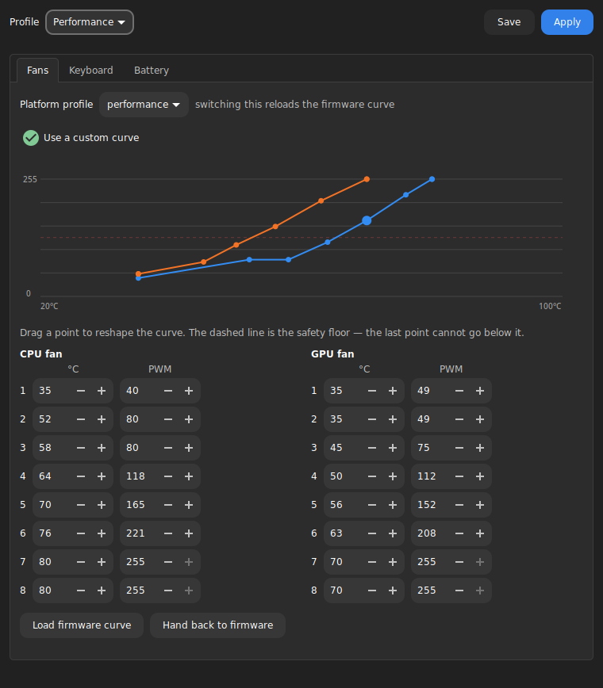
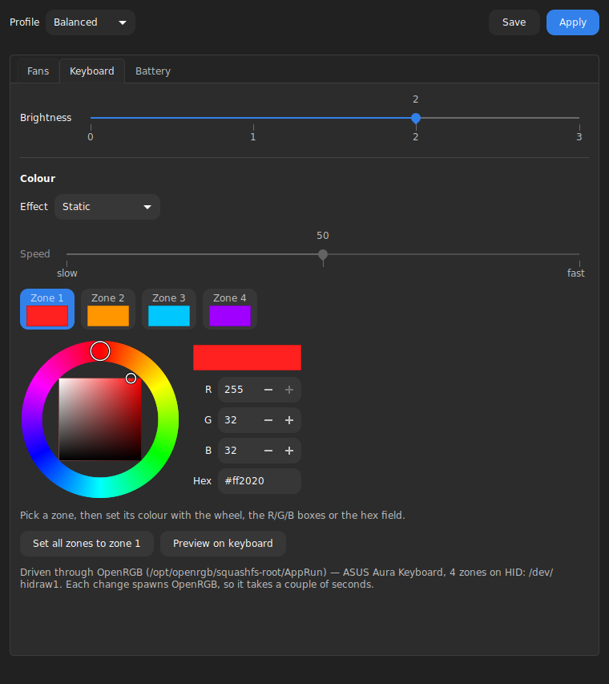

# strixctl

Battery charge limit, fan curves and keyboard backlight for ASUS ROG laptops on
Linux. A small GTK3 app that talks to the kernel's own sysfs interfaces.

Built and tested on a **ROG Strix G712LU**, Debian 13 (trixie), kernel 6.12,
Cinnamon. Sample size: one laptop. Mine.





## What this is

A vibecoded fun project, built for my own laptop with a lot of help from Opus 5.
It is not a polished product and does not pretend to be one.

It is, though, genuinely used and genuinely tested. Every claim below about what
this hardware does was checked by running it and then staring at the keyboard
like a weirdo, not inferred from a datasheet. Where something is untested, it
says so, because "should work probably" is how you end up filing a bug against
your own EC at 2am.

**Edits are most welcome**: issues, pull requests, or just a note saying what
did or did not work on your model. If you own an ASUS ROG laptop that is not a
G712LU, the single most useful thing you can send is your
`/sys/class/dmi/id/board_name` plus the output of `strixctl colour list`. That
is the whole ask. Two commands. Go on.

## Why another one

There are good tools in this space already, such as [zhelper][zhelper]
(GTK4/libadwaita, ASUS-specific), [batctl][batctl] (TUI/CLI, generic vendor
detection), and [asusctl][asusctl] (the reference implementation, Rust).
strixctl exists because of three gaps:

- **Debian.** asusctl upstream explicitly does not support it, and building it
  means a Rust toolchain plus dev headers. Respectfully: no.
- **Cinnamon/XFCE/MATE.** The tray integration here is XApp, not AppIndicator
  and not a GNOME Shell extension. If your desktop is not the one everybody
  writes tray code for, hi, welcome, this one is for us.
- **No daemon and no root at runtime.** One udev rule hands the sysfs
  attributes to a group you are already in. After that the app is an
  unprivileged process writing integers to files. No background service holding
  privileges, no polkit policy, no D-Bus.

(tl;dr: bro i just wanted to fix the problem i was having instead of trawling
through repos that half-work and allat. anyway. moving on.)

[zhelper]: https://github.com/ixoz/z-helper
[batctl]: https://github.com/Ooooze/batctl
[asusctl]: https://gitlab.com/asus-linux/asusctl

## Install

```sh
git clone https://github.com/TheKimi7/strixctl
cd strixctl
sudo ./install.sh
```

**If you already hand-rolled a charge-limit unit, disable it first.** A common
recipe is a oneshot that echoes a hardcoded value into
`charge_control_end_threshold` at boot. strixctl writes the same attribute from
`strixctl-apply.service`, and with no ordering between them the winner is
whichever runs last. Two units, one sysfs file, no referee:

```sh
sudo systemctl disable --now battery-charge-limit.service   # or whatever you named it
```

`install.sh` warns if it finds a unit like that, so you do not have to remember
what past you did.

The installer writes a udev rule and a oneshot service that together grant the
knobs to the `users` group (override with `STRIXCTL_GROUP=`). Both are needed:
udev covers the device-backed attributes, and the service covers
`/sys/firmware/acpi/platform_profile`, which is **not** a udev device on kernels
before 6.14, and there is no `platform-profile` class for a rule to match. Yes,
two mechanisms for one job. Take it up with the kernel.

To restore your profile at login:

```sh
systemctl --user enable --now strixctl-apply.service
```

Uninstall with `sudo ./install.sh --uninstall`. No hard feelings.

## What it controls

| Control | Interface | Status |
| --- | --- | --- |
| Battery charge limit | `BAT*/charge_control_end_threshold` | works |
| Platform profile | `/sys/firmware/acpi/platform_profile` | works |
| Fan curves, 8 points × 2 fans | `asus_custom_fan_curve` hwmon | works |
| Keyboard brightness | `asus::kbd_backlight` | works |
| Keyboard colour: 4 zones, 5 effects, speed | OpenRGB CLI to N-KEY `0b05:1866` | works, needs OpenRGB |

Profiles bundle the platform profile, both fan curves, keyboard brightness and a
colour, and switch together from the window or the tray. One click, whole vibe
changes.

### Keyboard colour goes through OpenRGB

The Keyboard page follows Aura Core's layout: an **effect** picker, a **speed**
slider, a row of zone swatches, and a hue-ring colour wheel with R/G/B and hex
fields, with whatever the chosen effect ignores greyed out. Click a zone to
choose what the wheel edits.

Five effects are offered:

```
Static           colour          zoned entry
Breathing        colour, speed   zoned entry
Flashing         colour, speed   per-key entry
Spectrum Cycle   speed           per-key entry
Rainbow Wave     speed           per-key entry
```

The list is filtered against what the hardware actually reports, so an effect
OpenRGB stops advertising disappears from the UI instead of leaving a button
that lies to you.

The per-key entry advertises ten more (Starry Night, Rain, the Reactive family,
Comet, Flash N Dash, Keystone, Direct, Off). They are written for per-key
boards and have not been checked on a 4-zone one, so they are deliberately not
offered rather than offered untested. Shipping a "Starry Night" that does
nothing is worse than not shipping it.

The window shows the five. `strixctl colour --mode` passes any name straight
through, so the untested ones are still reachable if you are feeling brave, and
a name the hardware does not know fails loudly rather than silently:

```sh
strixctl colour ff0000 --mode "Starry Night"    # works, untested here, godspeed
strixctl colour ff0000 --mode "Nonsense"        # Error: Mode not available
```

There is no sysfs path to colour on this chassis. `asus::kbd_backlight` is
brightness only, and nothing under `/sys/class/leds` carries a colour attribute.
Colour means HID writes to the ASUS N-KEY device (`0b05:1866`).

strixctl does not reimplement that protocol. It shells out to
[OpenRGB][openrgb], which already implements it and is maintained by people who
own the hardware. The cost is a subprocess and about two seconds per change; the
benefit is that nobody here is guessing bytes at an embedded controller and
hoping for the best.

The SDK socket was considered and rejected: decoding the controller-data blob is
several hundred lines of variable-length parsing (u16-length-prefixed strings,
mode and zone arrays, protocol-version-conditional fields) against a spec that
does not state its endianness. For a knob that changes on a profile switch,
`subprocess.run` is the better trade. I am not writing a parser for that. You
are not writing a parser for that. Nobody is writing a parser for that.

**Device selection is by name, LED count and advertised effect, never by
index.** Here is the fun part. On the G712LU, OpenRGB reports the one physical
keyboard *six* times, once each on `hidraw1` and `hidraw2` and four times on
`hidraw3`, plus a seventh entry, a per-key `G533ZM` one (also on `hidraw3`),
because it has no G712LU profile of its own (`[G712LU] device capabilities not
found`). One keyboard. Seven entries. It also thinks your laptop is a different
laptop. It is fine. Everything is fine.

Both kinds drive this chassis. They are the same keyboard seen two ways, and the
effect decides which one a write goes to:

- the **4-zone** entries take four independent colours, one per zone, but offer
  only Static, Breathing and Color Cycle;
- the **per-key** entry offers every effect, but a colour list sent there would
  paint the first four *keys* rather than the four zones, so it is used only for
  effects that need at most one colour.

`strixctl colour list` shows the whole picture:

```
z 0: ASUS Aura Keyboard (4 leds, HID: /dev/hidraw1)  per-zone colour, three effects
z 1: ASUS Aura Keyboard (4 leds, HID: /dev/hidraw2)  per-zone colour, three effects
  ...
k 5: G533ZM (83 leds, HID: /dev/hidraw3)  one colour, every effect
```

`./get-openrgb.sh` handles installing it; see [Requirements](#requirements). If
you would rather do it by hand, strixctl searches `PATH` and the usual AppImage
locations, and `openrgb.binary` in `config.json` overrides the search.

You do **not** need OpenRGB's own udev rules for the keyboard: the rule strixctl
installs already grants the N-KEY device to your group, so OpenRGB finds it
without root. (Its other device classes, i2c especially, still want root, which
is what its warning is about. The scary red text is not about you.)

[openrgb]: https://openrgb.org

## Requirements

istg bro this section should be read thoroughly. it is the one that decides
whether any of this does anything at all on your machine.

**Hardware and kernel.** An ASUS ROG laptop whose knobs the kernel already
exposes, which on a current kernel means the `asus_wmi` / `asus-nb-wmi` drivers.
Every one is independent, and strixctl shows a missing one as unavailable rather
than refusing to start:

| Feature | Needs |
| --- | --- |
| Battery charge limit | `BAT*/charge_control_end_threshold` |
| Platform profile | `/sys/firmware/acpi/platform_profile` |
| Fan curves | an `asus_custom_fan_curve` hwmon |
| Keyboard brightness | an `asus::kbd_backlight` LED |
| Keyboard colour | an ASUS N-KEY USB device, plus OpenRGB |

**Runtime.** Python 3 and the GTK 3 introspection bindings. Nothing from PyPI,
no virtualenv, nothing to compile, no `node_modules`. The code uses no syntax
newer than f-strings and is developed on Python 3.13.

```sh
sudo apt install python3-gi python3-gi-cairo gir1.2-gtk-3.0 gir1.2-xapp-1.0
```

| Package | Why |
| --- | --- |
| `python3-gi` | PyGObject, the GTK bindings everything is built on |
| `python3-gi-cairo` | Cairo drawing, for the fan curve plot and the colour wheel |
| `gir1.2-gtk-3.0` | the GTK 3 and GDK typelibs |
| `gir1.2-xapp-1.0` | the tray icon only, and imported lazily, so leave it out if you never run `strixctl tray` |

GTK 3 rather than GTK 4 because this targets Cinnamon, whose tray API (XApp) is
GTK 3 only. Not a hill I chose, just the one I live on.

**Optional: [OpenRGB][openrgb]**, needed only for keyboard *colour*. Everything
else works without it. There is a script, so you never have to think about
AppImages or fuse:

```sh
./get-openrgb.sh
```

It downloads a pinned OpenRGB release, checks it against a known SHA-256,
extracts it (Debian 13 ships no libfuse2, so a type-2 AppImage cannot mount
itself) and puts it in `~/.local/share/strixctl/openrgb`, which strixctl
searches on its own. Pass `--here` to put it in `./openrgb` beside the checkout
instead, which is handy when hacking on strixctl; that path is gitignored and
also searched.

The script refuses to run as root, and is kept out of `install.sh` on purpose:
that runs with sudo, and downloading a 33 MB binary and unpacking it as root is
a worse trade than typing one more command. `install.sh` only mentions the
script if it cannot find OpenRGB.

If you would rather install OpenRGB your own way, strixctl looks on `PATH` and
in the usual AppImage locations, or you can point `openrgb.binary` in
`config.json` straight at it.

## Usage

```sh
strixctl status          # every knob, its value, and whether it is writable
strixctl gui             # the control window
strixctl tray            # tray icon
strixctl battery 80      # charge limit; 'off' clears it back to 100%
strixctl profile Silent  # switch and apply
strixctl fans reset      # hand both fans back to the firmware curve
strixctl colour ff0000   # all four zones red
strixctl colour ff0000 ff3c00 ff7800 ffb400 --save   # per zone, stored in the profile
strixctl colour list     # what OpenRGB sees
```

`strixctl status` is the one to run first, and the one to paste into an issue.

Config lives in `~/.config/strixctl/config.json`.

## Editing a curve

Drag the control points on the graph, or type into the spin buttons. They are
two views of the same numbers, so either updates the other. Dragging is
constrained to the set of curves that pass validation, so a shape you can draw
is always a shape that will apply: each point is held between its neighbours,
and the last point cannot fall below the safety floor drawn as a dashed line.

The UI will not let you draw something the validator then rejects, because being
told "no" after the fact is deeply annoying.

## Fan curve safety

Custom curves are validated before they are armed: temperatures and PWM values
must be non-decreasing, and a curve asking for under 128/255 at 85 °C or above is
rejected. Your laptop is not a space heater and I would like it to stay that
way.

"Hand back to firmware" (`pwm*_enable = 2`) is one click away in the window, one
item in the tray menu, and `strixctl fans reset` on the command line. Three
escape hatches, because fans are the one thing here that can actually cook
something.

Switching the platform profile makes the firmware reload its own curve, so
strixctl re-arms a custom curve immediately afterwards. That ordering matters:
applying the curve first and the profile second silently loses the curve, which
is a genuinely infuriating bug to chase.

## Known gaps

- Keyboard colour needs OpenRGB installed. Not a hard dependency, and the UI
  tells you rather than just greying out and sulking.
- Each colour change spawns OpenRGB (~2s). If that ever matters, OpenRGB's CLI
  can talk to its own running server with `--client localhost:6742`.
- No re-apply after suspend/resume. The EC normally keeps its state; if yours
  does not, run `strixctl apply` from the tray.
- CPU TDP tuning needs the `asus-armoury` driver, mainline only from 6.19. So
  that is a "later" problem.
- Tested on exactly one laptop. The backends probe rather than assume, so other
  ROG/TUF models should degrade to "not present" rather than misbehave, but
  "should" is doing heavy lifting in that sentence. Tell me what happens.

## License

MIT. Do whatever you like with it. If your fans get loud, that is between you
and your laptop.
